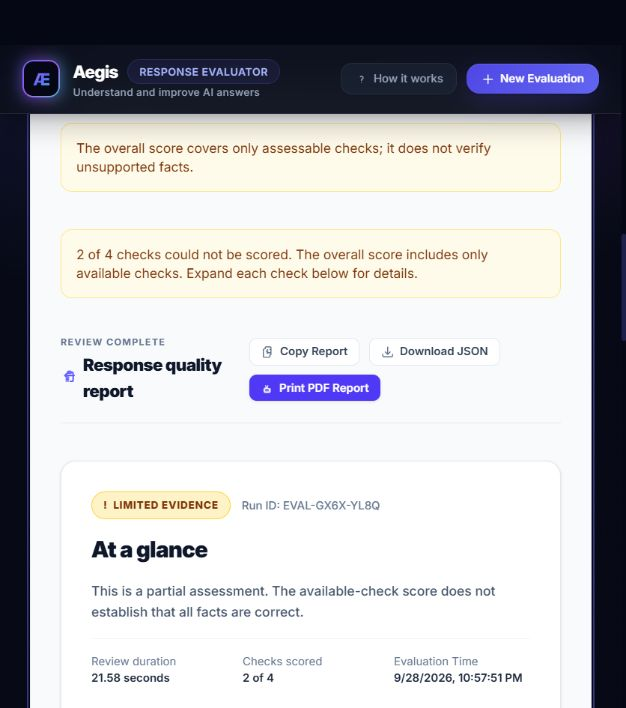
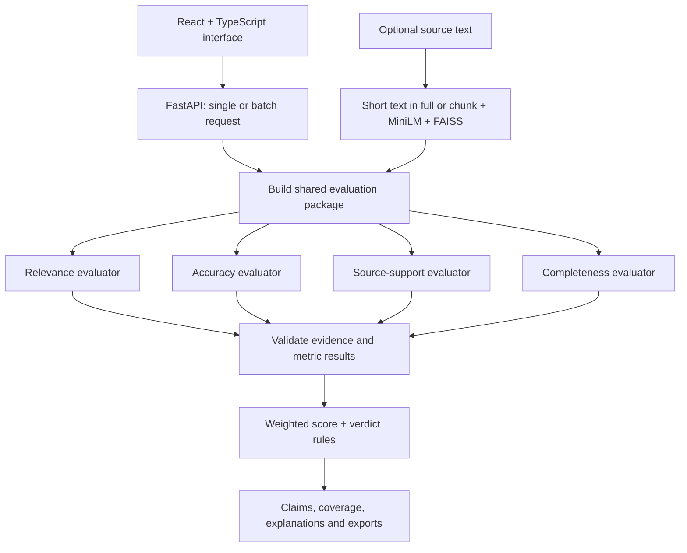

# Aegis — AI Response Quality Evaluator

[](https://github.com/TanmayVyavahare/Infosys-AI-Response-evaluator/actions/workflows/ci.yml)

A full-stack application that reviews AI-generated answers across **relevance, factual accuracy, source support, and completeness**. Aegis combines independent LLM evaluators, retrieval over supplied source material, and an evidence-aware report to explain **what an answer gets right, what it misses, and what cannot be verified**.

Built with **React, TypeScript, FastAPI, Sentence Transformers, and FAISS**. Groq is the configured live provider; the provider interface also includes OpenAI, Gemini, and local Ollama adapters.

[Features](#features) · [Measured results](#measured-results) · [Quick start](#quick-start) · [Architecture](#architecture) · [Testing](#testing) · [Limitations](#limitations)

## Features

- **Four separate quality checks.** Topic relevance stays separate from factual correctness, evidence support, and requirement coverage.
- **Claim-level evidence.** Distinguishes correct, incorrect, unverifiable, conflicting, supported, unsupported, and contradicted claims. Incorrect factual verdicts require a contradictory passage present in the supplied reference or source.
- **Evidence-aware scoring.** Missing evidence produces N/A checks and a limited-evidence verdict. Conflicting sources are disclosed. Reports show the fraction of claims verified and the number of checks scored instead of invented confidence percentages.
- **Single and batch workflows.** Review one answer or import a CSV with up to **50 responses**. Map columns, preview inputs, inspect individual reports, and compare batch averages and verdict distributions.
- **Strict input handling.** Rejects malformed CSV, duplicate headers, missing required cells, and oversized files instead of silently dropping data. TXT, Markdown, JSON source files and CSV uploads are limited to **5 MB** in the interface.
- **Retrieval over source text.** Short excerpts are evaluated in full. Longer sources are chunked, embedded with MiniLM, and searched through FAISS, with document-hash-based disk caching.
- **Useful reports and exports.** Per-check explanations, atomic claims, requirement coverage, strengths, improvement suggestions, JSON download, clipboard summaries, and browser printing.
- **Responsive, keyboard-accessible interface.** Labeled fields, optional evidence disclosure, mobile layouts, help dialog keyboard behavior, and preserved drafts when switching review modes.
- **Resilient requests.** Cancellation rejects late browser responses. Provider timeouts, bounded retries, schema validation, and explicit partial-result warnings keep failures visible. Batch execution is limited to **3 simultaneous responses**.

### Report preview



This example intentionally has no reference or source. The report explains that only two checks were scored instead of claiming that the facts were verified.

## Measured results

| Measurement | Observed result | What it means |
|---|---|---|
| Synthetic quality audit | **16 distinct scenarios** | Correct answers, wrong facts, omissions, paraphrases, unit conversions, missing evidence, source conflicts, abstention, and embedded grading instructions |
| Case expectations met | **10/16 → 15/16** in the latest completed comparison | Five additional cases met the defined rubric; this is a small regression sample, **not** a general model-accuracy claim |
| Automated verification | **108 automated tests passed locally**: 91 backend + 17 frontend | Includes real MiniLM embeddings, FAISS retrieval/cache, evidence rules, API validation, CSV import, cancellation, state preservation, and report actions |
| Batch capacity | **50 rows**, **3 responses in flight** | Implemented and tested limits; no unmeasured throughput or speedup claim |
| Default retrieval | **384-dimensional embeddings**, **top 5 chunks** | MiniLM + normalized FAISS inner-product search; configurable chunking and thresholds |

The final unknown-fact safeguard passed deterministic tests and a later [focused live accuracy recheck](quality_review/final-accuracy-check.json), correctly returning `UNVERIFIABLE`. The complete 16-case benchmark was not rerun after that guard because of provider quota limits, so the table retains the last full comparison. The [quality review](quality_review/REPORT.md) includes unsuccessful runs as well as successful ones. [Raw baseline](quality_review/before-paced.json) and [latest completed reports](quality_review/latest-completed.json) make the comparison inspectable.

The [verified CI run](https://github.com/TanmayVyavahare/Infosys-AI-Response-evaluator/actions/runs/36461226724) passed all 80 tests, frontend lint, and the production build on a clean Linux environment. See [CI runs](https://github.com/TanmayVyavahare/Infosys-AI-Response-evaluator/actions) for subsequent results, and [QA notes](QA_NOTES.md) for local browser checks and environment limitations.

## Quick start

### Prerequisites

- **Python 3.11** for the backend and the tested ML dependency set.
- **Node.js 24** and npm for the frontend. Vite requires Node 20.19+ or 22.12+; CI uses Node 24.
- A Groq API key for live evaluation. Other provider adapters require their respective configuration.
- Internet access on first use to download the public MiniLM embedding model. A supported native ML environment is needed for long-source retrieval and local fallback scoring.

### 1. Clone

```bash
git clone https://github.com/TanmayVyavahare/Infosys-AI-Response-evaluator.git
cd Infosys-AI-Response-evaluator
```

### 2. Start the backend

```bash
cd backend
python -m venv .venv
```

Activate it with **one** command for your shell:

```powershell
# Windows PowerShell
.venv\Scripts\Activate.ps1
```

```bash
# macOS / Linux
source .venv/bin/activate
```

Install and create your local configuration:

```bash
python -m pip install -r requirements-dev.txt
python -c "from pathlib import Path; p=Path('.env'); p.exists() or p.write_text(Path('.env.example').read_text())"
```

Edit `backend/.env`:

```dotenv
LLM_PROVIDER=groq
LLM_MODEL=openai/gpt-oss-20b
GROQ_API_KEY=your_key_here
```

Then run:

```bash
python -m uvicorn app.main:app --reload --host 127.0.0.1 --port 8000
```

Credentials stay in the ignored backend `.env`; never put them in frontend variables or commit them. The backend finds this file independently of the launch directory. Restart after changing provider settings.

### 3. Start the frontend

In a second terminal, from the repository root:

```bash
cd frontend
npm ci
npm run dev
```

Open [http://localhost:5173](http://localhost:5173). Interactive API documentation is at [http://127.0.0.1:8000/docs](http://127.0.0.1:8000/docs). The Vite development server proxies `/api` to the backend.

### 4. Try a review

Use **Try an example**, or enter:

- **Question:** What does the Orion plan cost and how long is the trial?
- **AI response:** It costs 20 credits per month and includes a 14-day trial.
- **Reference/source:** The Orion plan costs 20 credits per month. The trial lasts 14 days.

Change the response to "200 credits" to test a contradiction, omit the trial to test completeness, or remove the evidence to inspect a limited-evidence report.

For batch review, upload [examples/review-cases.csv](examples/review-cases.csv) and match its columns. Samples contain fictional facts only.

## Architecture



Each evaluator receives the same package and runs independently through `asyncio.gather()`. It first requests a structured LLM assessment, validates the response, and retries malformed results. When AI review is unavailable, reference-aware local estimates remain available for relevance and completeness if the embedding model can load. Accuracy and source support explicitly abstain: cosine similarity cannot establish factual truth, negation, entity roles, or equivalent units. Reports preserve the provider limitation and label scored fallback results `Local Estimate`, including mixed AI/local reviews.

| Layer | Implementation |
|---|---|
| Interface | React 19, TypeScript, Vite, Tailwind CSS 4 |
| API and schemas | FastAPI, Pydantic, Uvicorn |
| Provider abstraction | Groq, OpenAI, Gemini, Ollama adapters |
| Semantic retrieval | Sentence Transformers `all-MiniLM-L6-v2`, NumPy, FAISS |
| Quality controls | Claim verification, source-quote validation, requirement coverage, verdict overrides |
| Verification | pytest, Vitest, Testing Library, lint, TypeScript build, GitHub Actions |

### Scoring rules

| Dimension | Weight | Basis |
|---|---:|---|
| Relevance | 25% | Whether the response's content addresses the requested topic |
| Accuracy | 30% | Correct / verifiable claims; unknown and conflicting claims are excluded and disclosed |
| Source support | 25% | Supported claims / assessed claims |
| Completeness | 20% | `(covered + 0.5 × partial) / requested requirements` |

Weights are renormalized over available metrics. Important failures cannot disappear in an average: off-topic answers, serious factual errors, insufficient source support, and substantial omissions have verdict overrides. Half or fewer requirements covered produces `Incomplete` and caps the overall score below the acceptable threshold. Missing checks and unknown claims prevent an unconditional high-quality verdict; source conflicts are flagged separately.

A score is **not a probability of truth**. The legacy API `confidence` field represents the fraction of four checks scored; the UI calls it **Checks scored**. Local estimates never receive an authoritative quality verdict. A quote's presence does not prove the model interpreted it correctly.

## API

| Method | Route | Purpose |
|---|---|---|
| `POST` | `/api/evaluate` | Evaluate one question/answer pair |
| `POST` | `/api/evaluate/batch` | Evaluate an ordered JSON array of 1–50 pairs; return row reports and aggregates |
| `GET` | `/api/health` | Process liveness and configured provider/model; does not test provider quota or model readiness |
| `GET` | `/docs` | Interactive OpenAPI documentation |

```json
{
  "question": "What does Orion cost?",
  "ai_response": "Orion costs 20 credits per month.",
  "reference_answer": "20 credits monthly.",
  "source_document": "The Orion plan costs 20 credits per month."
}
```

Only `question` and `ai_response` are required. Responses contain `metrics`, `overall_score`, `verdict`, `warnings`, `processing_time_seconds`, and improvement suggestions. Each metric can include claims, evidence, and requirement coverage. Browser source files are read as text and submitted through these endpoints; there is no standalone document-upload API.

## Testing

From the repository root, with the backend environment activated:

```bash
python -m pytest backend/tests -q
npm ci --prefix frontend
npm test --prefix frontend
npm run lint --prefix frontend
npm run build --prefix frontend
```

The full backend suite includes **real MiniLM and FAISS checks**. It requires the public model download and working native dependencies; it does not require paid API credentials. The Linux CI job installs CPU PyTorch and runs the full suite. Live provider calls are confined to the explicitly invoked audit script.

Run the lightweight API/provider/report regressions when the embedding stack is unavailable:

```bash
python -m pytest backend/tests/test_local_review.py backend/tests/test_quality_rules.py backend/tests/test_workflow_regressions.py backend/tests/test_llm_provider.py -q
```

Run the live synthetic audit explicitly (consumes configured Groq quota):

```bash
python quality_review/run_live_audit.py quality_review/new-run.json
python quality_review/check_audit.py quality_review/new-run.json
```

Append case IDs after the output filename to run selected cases. Saved runs are never overwritten. The archived 16-case comparison intentionally retains its one unresolved expectation rather than hiding it.

For a diverse interview-style live check (12 planned cases across history, programming, arithmetic, unit conversion, negation, short answers and Hindi):

```bash
python quality_review/run_demo_audit.py quality_review/demo-new-run.json
```

This requires available Groq quota. The saved [attempt](quality_review/demo-audit.json) stopped after quota failures and is **not a completed quality benchmark**. The Washington completeness check separately returned 1.0 in a live AI call; the corrected local path is covered by real-model regression tests. See [fallback reliability notes](quality_review/FALLBACK_RELIABILITY.md).

Before an interview demo, run an example and inspect the report method and warnings. `AI review` identifies model judgments; `Local Estimate` means provisional topical/coverage checks. With only a reference answer, source support is unavailable until source material is also supplied. No fixed test suite guarantees correct grading of every arbitrary question.

## Repository layout

```text
backend/app/api/            FastAPI routes
backend/app/evaluation/     Four evaluators, prompts and local heuristics
backend/app/retrieval/      Chunking, embeddings, FAISS and cache
backend/app/services/       Coordination and provider adapters
backend/app/schemas/        Request/response contracts
backend/tests/              Unit, workflow and real-model integration tests
frontend/src/               React UI, state, API client and typed reports
frontend/tests/             UI and request regression tests
examples/                   Synthetic batch-review CSV
quality_review/             Audit runner, expectations, reports and evidence
.github/workflows/          Automated frontend/backend verification
```

## Limitations

- This is a portfolio application, not an independently certified fact checker. LLM judgments can vary, and the small synthetic audit does not establish domain-wide accuracy or prompt-injection immunity.
- Groq limits and model availability depend on the account. Exhausted quota may yield partial results. Other provider adapters exist but have not received the same live audit as Groq.
- Earlier restricted Windows checks could not load the native ML stack. The latest complete backend run passed on Windows with the cached public model and normal approved process access; no device protection was changed. The app now loads the cached model first, avoiding unnecessary network metadata retries on every startup.
- Input drafts and reports live in the current browser session. Cancel stops waiting in the browser; server work already accepted may finish. Printed PDF layout and actual download completion depend on the browser.
- Sources are supplied by the user; Aegis does not independently browse the web. Submitted review text is sent to the selected external LLM provider when enabled.
- Authentication, multi-user data isolation, persistent report storage, and deployment-level rate limiting are not implemented. Add them before exposing the service publicly.

## Resume-ready project highlights

Use these as implementation-backed project descriptions, with the audit scope kept explicit:

- Built a React/TypeScript and FastAPI evaluation application with **four concurrent quality dimensions**, claim-level evidence, requirement coverage, and explainable verdicts.
- Implemented **384-dimensional MiniLM embeddings**, FAISS retrieval, source chunking, and disk caching, alongside an interchangeable interface for **four LLM providers**.
- Added **50-row CSV evaluation** with validated column mapping, bounded concurrency, per-row inspection, and JSON/print report exports.
- Designed a **16-scenario synthetic regression audit** and improved satisfied case expectations from **10 to 15**, correcting misleading evidence, coverage, and source-conflict reporting; added **108 automated tests passing locally**, including real embedding/search integration checks.
