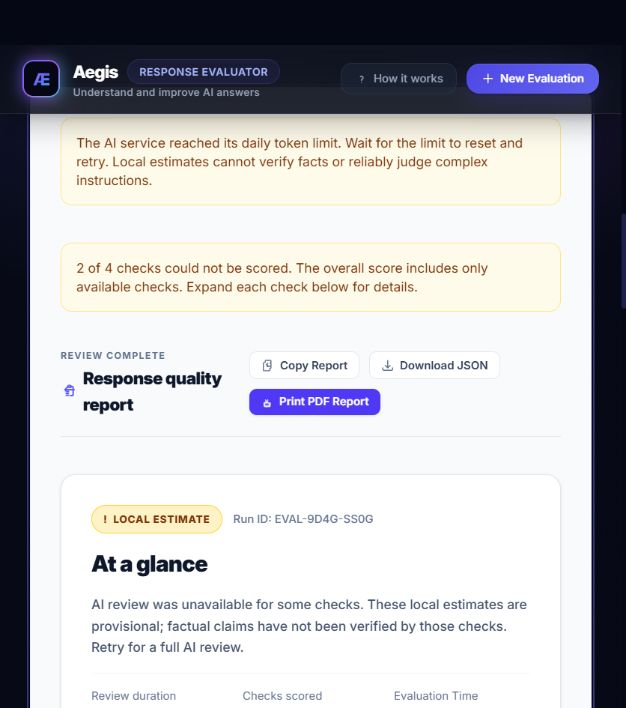

# Evaluation reliability follow-up

The screenshot answer naming George Washington and his service years was complete. Its old 17% completeness score came from local heuristics, not an AI judgment. The local parser invented a third requirement from "United States" and compared answer sentences against isolated question fragments.

## Changes

- Requirements now come from explicit question clauses; proper names, quoted phrases, and extra reference facts do not create additional tasks. Noun pairs such as "lists and tuples" stay together.
- Relevance also compares answers with the supplied reference. Coverage can use strong reference alignment, with a content-coverage guard and the parent question retained for pronouns.
- Similarity no longer certifies factual accuracy or source support. Those checks abstain when AI review is unavailable, including cases involving negation, reversed entity roles, changed numbers and unit conversions.
- Partial local reviews display a **Local Estimate** verdict, provisional score, and provider warning. Reports retain these limitations in exports.
- Exhausted daily quota fails promptly; brief request-rate limits retain bounded retries. Installed embedding models load from cache before contacting the model host.

## Evidence and limits

- **91 backend tests + 17 frontend tests passed locally**, including actual MiniLM/FAISS integration, the exact screenshot regression, short answers, missing dates, misleading similarity, API errors, CSV workflows and report exports. Frontend lint and build passed.
- The exact screenshot fallback regression now finds **two requirements and 100% estimated completeness**. Removing the service dates reduces completeness. This is a regression result, not proof that arbitrary local judgments are correct.
- A live Groq completeness call returned **1.0**, with both identity and service period covered. The browser later independently displayed 100% AI completeness alongside a 99% local relevance estimate and unavailable fact checks, clearly marked provisional.
- The planned diverse **12-case live audit did not finish** because Groq reported daily token exhaustion. `demo-audit.json` preserves the two attempted reports, including the intermediate fallback result before parent-question context was fixed. It must not be counted as a completed benchmark or a 12-case pass.
- Previous 16-scenario audit results remain historical evidence, separately documented. Automated regression totals measure software checks, not universal evaluator accuracy.

For an interview, verify provider quota beforehand and inspect **AI review** versus **Local estimate** in each report. Any arbitrary question, reference, or answer can still expose judgment errors. A trustworthy evaluator should report uncertainty rather than pretend similarity proves truth.

## Final verification

[GitHub CI run 36465898391](https://github.com/TanmayVyavahare/Infosys-AI-Response-evaluator/actions/runs/36465898391) passed both jobs for code commit `3b5bcf58f62182f784173e87449189b6a4b581c1`, including the full backend suite, frontend tests, lint and production build.

The final browser run returned in **5.25 seconds**, with 99% estimated relevance, 100% estimated completeness (2/2 requirements), unavailable fact checks, and an explicit daily quota warning. A preceding run spent 85.22 seconds waiting on the old quota retry behavior. These are two observed runs, not a latency benchmark.

